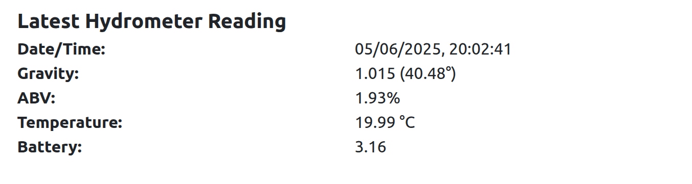

# Pico Tilt Hydrometer

Just like DIY? Yeah, me too. I'm all for supporting the existing market place offerings but I was keen to try this for myself (it didn't look too hard, spoiler - it wasn't) and there's no obvious local solution. 

I also keen to try:
* the 'impossible' - could a pi pico work with deepsleep mods?
* to use WIFI - water and 2.4ghz are not friends others use bluetooth - let's say I much prefer wifi and was keen to see if it was possible
  - that said WIFI is a hungry beast even 10s bursts are to much?

This is what I ended up with ...

Did it work .. yes, kindof .. more below.

Spolier:
* WIFI - yes comms can work. The key was to have the wifi 'chip' touching the top of the cap so it clears the water surface ;)
* Deepsleep - jury is still out - I need more testing, so far can only get about 5 days @ 6 hourly readings - try again @ 12 hourly?

# PICO deepsleep 

Best article on this I have found here https://ghubcoder.github.io/posts/deep-sleeping-the-pico-micropython/

The base for this test is therefore https://github.com/ghubcoder/micropython-pico-deepsleep.git

# Hardware 

* Centrifuge Tube, 50mL with cap，round bottom - NOTE: 50ml is really too small, check the other tubes they're much bigger maybe 75-120ml - this provides more room for the electronics and tweaking base tilt angles.
  - Pre-forms would be ideal but found them hard to source in NZ without buying blind and hoping, not expensive but kinda key.
* Pico W (no headers)
* GY-9250 (MPU-9250) - 9-Axis Altitude + Gyro + Accelerator + Magnetometer Sensor Module
  - imo.py and vector3d.py - see https://github.com/micropython-IMU should probably use mpu9250.py in place of the generic imu
* Panasonic NCR18650BD 18650 Lithium Ion Battery https://www.simpower.co.nz/product/individual-cells-batteries/lithium-batteries/18650-batteries/panasonic-ncr18650bd-18650-lithium-ion-battery/
* 3d printed housing (with pegs) - see models folder for latest iteration
* Misc - Wires, Solder, etc
  - I also used some battery plates and springs that slide into the printed housing

# Software

* Pico running compiled 'deepsleep' firmware with main python scripts and libraries
  - See config for wifi connection and post end-point
  - default sleep is 2 minutes - the HTTP post response can change this to be 12-24 hours 
* Server to 'collect' the JSON post from the tilt hydrometer and log the data 
  - Flask
    - The JSON post response provides the sleep time
  - Python
  - R scipts for graphing

# Testing / Calibration

* Existing tilt hydrometer with varying sugar solutions (choose at what you need to get the polynomial to make sense - see below)
  - 1.000 Water
  - 1.010
  - 1.020
  - 1.030
  - 1.040
  - 1.050
* Plot them a choose a line of best fit (polynomial o3, or a straight line)
* Ideally have 15-20deg in water raising to close to 40+ in strong solution
  -  The denser the flatter

